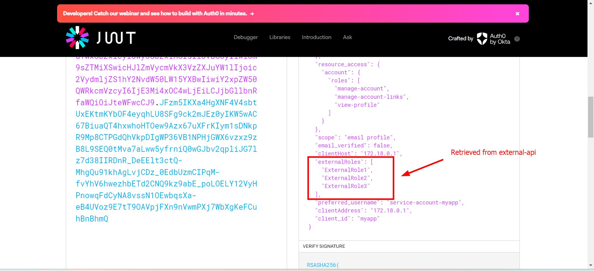
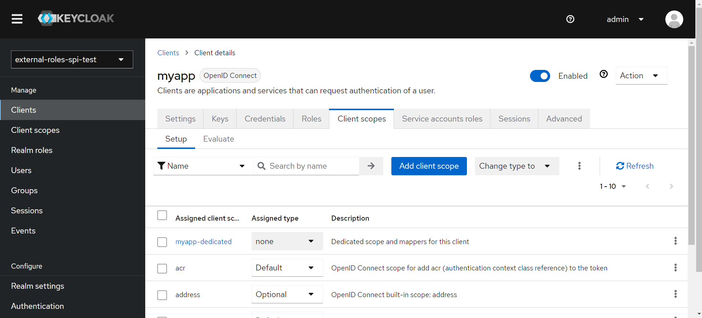
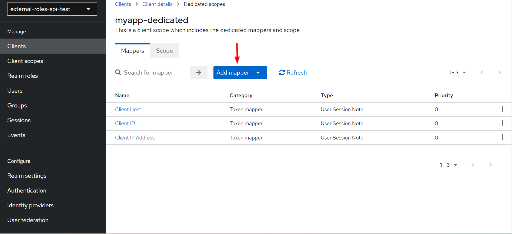
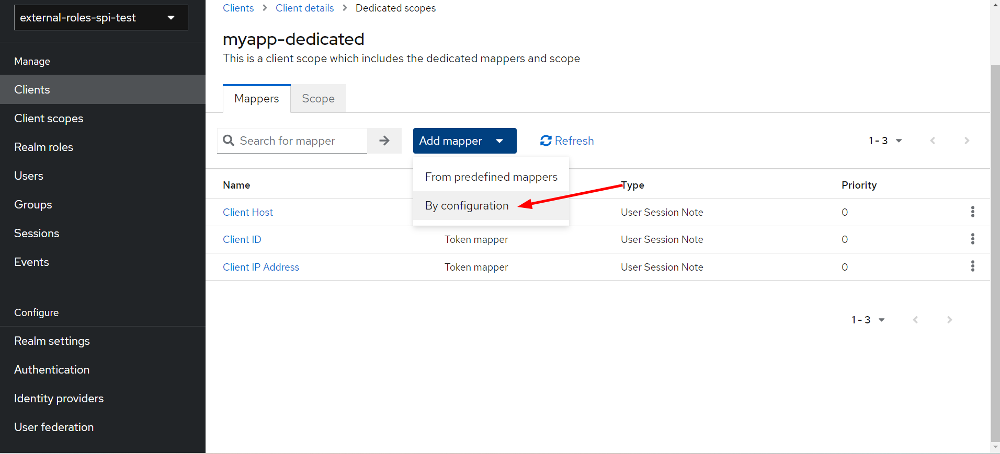
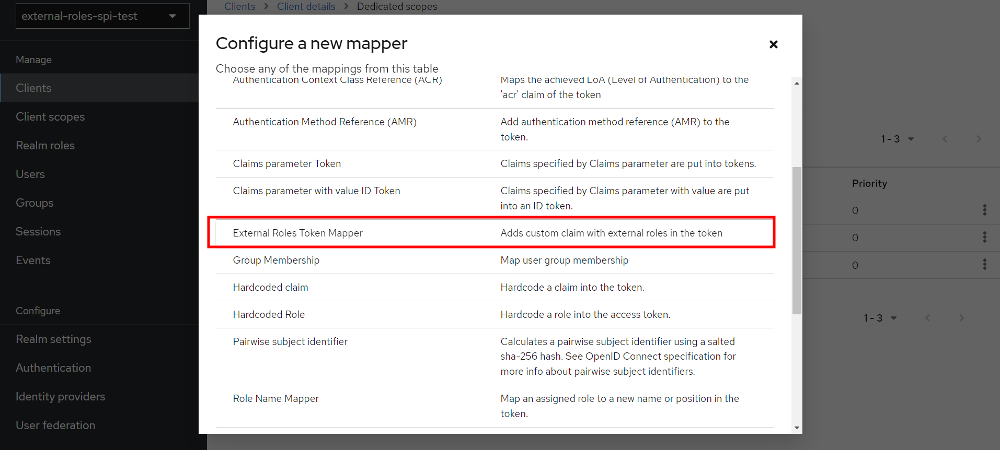
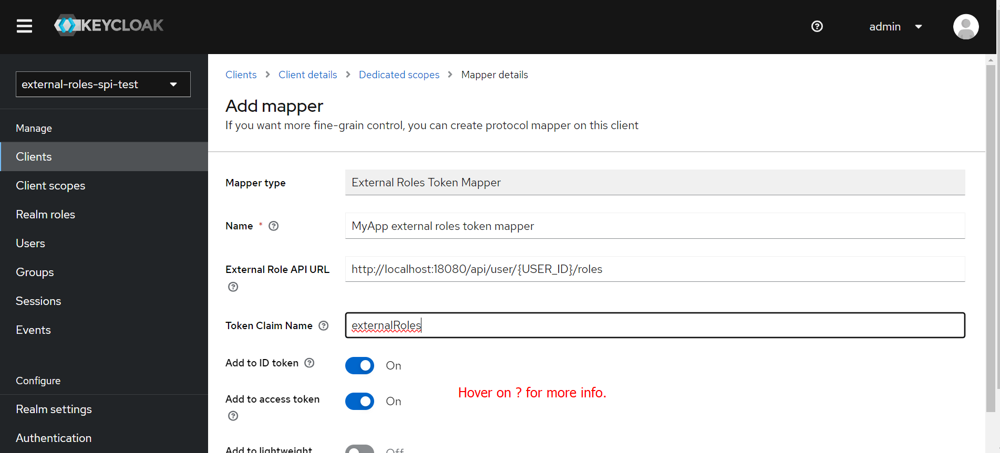

# keycloak-spi-poc
This is a POC for building Keycloak SPI extension that would allow adding custom claims in a JWT token (accessToken, idToken, userinfoToken).
The POC consists of 2 modules:
- keycloak-spi - the actual implementation of the SPI
- external-api - simple SpringBoot application that exposes an API that Keycloak will consume to retrieve the external roles.

## Running the POC
In order to run the poc you need to:
- `mvn clean install` This will build both the SPI and the External API Spring Boot app.
- `docker compose up` This will run docker compose i.e. run Keycloak and External API Spring Boot app. Note that on Keycloak start, 
the SPI is copied into Keycloak's designated directory for external providers, so it becomes available for use. In addition, a preconfigured 
Realm will be imported in Keycloak. The realm contains myapp client that is already configured with the custom provider implemented in the SPI.

## Verifying that claim is added in JWT
1. Get JWT token using the following CURL command:
`curl --location 'http://localhost:8180/auth/realms/external-roles-spi-test/protocol/openid-connect/token' \
   --header 'Content-Type: application/x-www-form-urlencoded' \
   --data-urlencode 'client_id=myapp' \
   --data-urlencode 'client_secret=7g8sAGV9RmCkLI67l8xQMEF6WSuAm8Qr' \
   --data-urlencode 'grant_type=client_credentials'`
2. Copy the provided token and analyse it in https://jwt.io/  
The following claim will be added:  

### Configuring the External Roles Token Mapper
Below you can find the steps to configure the External Roles Token Mapper from the Keycloak GUI.

